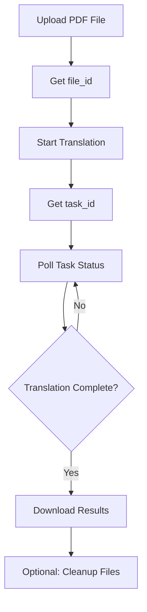

# PDFMathTranslate API Documentation

## Overview

PDFMathTranslate provides a RESTful API for translating PDF documents while preserving mathematical formulas, tables, and formatting. The API supports multiple translation engines and offers extensive customization options.

## Base URL

```
http://localhost:8000
```

## Authentication

Currently, the API does not require authentication. In production environments, appropriate authentication should be implemented.

## API Workflow

The typical workflow for translating a PDF document:



## Endpoints

### Health Check

Check API server status.

```http
GET /api/health
```

**Response:**
```json
{
  "status": "healthy",
  "active_tasks": 0,
  "completed_tasks": 5
}
```

### Get Available Languages

Retrieve list of supported languages for translation.

```http
GET /api/languages
```

**Response:**
```json
[
  {
    "display_name": "English",
    "code": "en"
  },
  {
    "display_name": "Simplified Chinese",
    "code": "zh"
  }
  // ... more languages
]
```

### Get Available Services

Retrieve list of available translation services.

```http
GET /api/services
```

**Response:**
```json
[
  {
    "name": "gpt-4o-mini",
    "fields": [
      {
        "name": "model_name",
        "description": "模型名称 (GPT-4o Mini)",
        "type": "str",
        "default": "gpt-4o-mini",
        "required": true,
        "is_password": false,
        "readonly": true
      }
    ]
  }
  // ... more services
]
```

### Upload PDF File

Upload a PDF file for translation.

```http
POST /api/files/upload
Content-Type: multipart/form-data

file: <binary PDF data>
```

**Parameters:**
- `file` (required): PDF file to upload (max 100MB)

**Response:**
```json
{
  "file_id": "550e8400-e29b-41d4-a716-446655440000",
  "filename": "document.pdf",
  "size": 1024000,
  "message": "File uploaded successfully"
}
```

**Error Responses:**
- `400`: Invalid file format or empty file
- `413`: File too large (>100MB)

### Start Translation

Start a translation task with uploaded file.

```http
POST /api/translate
Content-Type: application/json

{
  "file_id": "550e8400-e29b-41d4-a716-446655440000",
  "config": {
    "service": "gpt-4o-mini",
    "lang_from": "English",
    "lang_to": "Simplified Chinese",
    "page_range": "All",
    "threads": 4
  }
}
```

**Request Body:**

| Field | Type | Default | Description |
|-------|------|---------|-------------|
| file_id | string | required | File ID from upload endpoint |
| config | object | required | Translation configuration |

**Configuration Parameters:**

| Parameter | Type | Default | Description |
|-----------|------|---------|-------------|
| service | string | "gpt-4o-mini" | Translation service to use |
| lang_from | string | "English" | Source language |
| lang_to | string | "Simplified Chinese" | Target language |
| page_range | string | "All" | Pages to translate: "All", "First", "First 5 pages", "Range" |
| page_input | string | null | Custom page range (e.g., "1,3,5-10") when page_range="Range" |
| threads | integer | 4 | Request rate limit (1-20) |
| no_mono | boolean | false | Disable mono-language output |
| no_dual | boolean | false | Disable dual-language output |
| dual_translate_first | boolean | false | Put translated text first in dual output |
| watermark_output_mode | string | "No Watermark" | "Watermarked" or "No Watermark" |
| min_text_length | integer | 10 | Minimum text length to translate |
| no_auto_extract_glossary | boolean | true | Disable automatic glossary extraction |
| translate_table_text | boolean | true | Translate text in tables |
| skip_clean | boolean | false | Skip cleaning step (improves compatibility) |
| enhance_compatibility | boolean | false | Enhanced compatibility mode |
| ignore_cache | boolean | false | Force re-translation |

**Response:**
```json
{
  "task_id": "660e8400-e29b-41d4-a716-446655440001",
  "status": "started"
}
```

### Get Task Status

Poll translation task status.

```http
GET /api/task/{task_id}/status
```

**Response:**
```json
{
  "status": "running",
  "progress": 45,
  "stage": "Translating pages",
  "part_index": 1,
  "total_parts": 1,
  "stage_current": 5,
  "stage_total": 10,
  "error": null,
  "result": null
}
```

**Status Values:**
- `running`: Task in progress
- `completed`: Task completed successfully
- `error`: Task failed
- `cancelled`: Task was cancelled

**Completed Response:**
```json
{
  "status": "completed",
  "progress": 100,
  "stage": "Translation complete",
  "result": {
    "mono_pdf_path": "/path/to/mono.pdf",
    "dual_pdf_path": "/path/to/dual.pdf",
    "total_seconds": 23.5,
    "storage": {
      "mono": {
        "access_url": "https://storage.example.com/...",
        "file_hash": "sha256hash",
        "storage_key": "documents/..."
      },
      "dual": {
        "access_url": "https://storage.example.com/...",
        "file_hash": "sha256hash",
        "storage_key": "documents/..."
      }
    }
  }
}
```

### Download Results

Download translated PDF files.

```http
GET /api/task/{task_id}/download/{file_type}
```

**Parameters:**
- `task_id`: Task ID from translation endpoint
- `file_type`: "mono" or "dual"

**Response:**
- Content-Type: `application/pdf`
- Binary PDF file data

**Error Responses:**
- `404`: Task or file not found
- `400`: Translation not completed

### Cancel Task

Cancel a running translation task.

```http
POST /api/task/{task_id}/cancel
```

**Response:**
```json
{
  "status": "cancelled"
}
```

### Cleanup Task

Remove task data and associated files.

```http
DELETE /api/task/{task_id}
```

**Response:**
```json
{
  "status": "cleaned"
}
```

### Cleanup Uploaded File

Remove uploaded file from server.

```http
DELETE /api/files/{file_id}
```

**Response:**
```json
{
  "status": "cleaned",
  "message": "File 550e8400-e29b-41d4-a716-446655440000 has been deleted"
}
```

## Error Handling

All endpoints follow a consistent error response format:

```json
{
  "detail": "Error message description"
}
```

Common HTTP status codes:
- `200`: Success
- `400`: Bad request (invalid parameters)
- `404`: Resource not found
- `413`: Payload too large
- `422`: Validation error
- `500`: Internal server error

## Example Usage

### Python Example

```python
import requests
import time

# 1. Upload PDF
with open("document.pdf", "rb") as f:
    response = requests.post(
        "http://localhost:8000/api/files/upload",
        files={"file": f}
    )
    file_id = response.json()["file_id"]

# 2. Start translation
response = requests.post(
    "http://localhost:8000/api/translate",
    json={
        "file_id": file_id,
        "config": {
            "service": "gpt-4o-mini",
            "lang_from": "English",
            "lang_to": "Simplified Chinese",
            "page_range": "All"
        }
    }
)
task_id = response.json()["task_id"]

# 3. Poll for completion
while True:
    response = requests.get(f"http://localhost:8000/api/task/{task_id}/status")
    status = response.json()
    
    if status["status"] == "completed":
        break
    elif status["status"] in ["error", "cancelled"]:
        raise Exception(f"Translation failed: {status.get('error')}")
    
    time.sleep(2)

# 4. Download results
for file_type in ["mono", "dual"]:
    response = requests.get(
        f"http://localhost:8000/api/task/{task_id}/download/{file_type}"
    )
    with open(f"translated_{file_type}.pdf", "wb") as f:
        f.write(response.content)
```

### cURL Example

```bash
# Upload file
FILE_ID=$(curl -X POST http://localhost:8000/api/files/upload \
  -F "file=@document.pdf" \
  | jq -r '.file_id')

# Start translation
TASK_ID=$(curl -X POST http://localhost:8000/api/translate \
  -H "Content-Type: application/json" \
  -d "{
    \"file_id\": \"$FILE_ID\",
    \"config\": {
      \"service\": \"gpt-4o-mini\",
      \"lang_from\": \"English\",
      \"lang_to\": \"Simplified Chinese\"
    }
  }" \
  | jq -r '.task_id')

# Check status
curl http://localhost:8000/api/task/$TASK_ID/status

# Download results
curl http://localhost:8000/api/task/$TASK_ID/download/mono -o translated_mono.pdf
curl http://localhost:8000/api/task/$TASK_ID/download/dual -o translated_dual.pdf
```

## Rate Limiting

The API currently does not implement rate limiting. The `threads` parameter in the translation config controls the request rate to translation services.

## Best Practices

1. **File Size**: Keep PDF files under 100MB for optimal performance
2. **Polling Interval**: Poll status every 2-5 seconds to avoid overwhelming the server
3. **Cleanup**: Always clean up files after downloading results to free server resources
4. **Error Handling**: Implement proper retry logic for network failures
5. **Page Range**: Use specific page ranges for large documents to reduce processing time

## Environment Variables

Configure the API server using these environment variables:

```bash
# Server configuration
HOST=127.0.0.1
PORT=8000
LOG_LEVEL=info

# Translation service keys
OPENAI_API_KEY=your-key
OPENAI_BASE_URL=https://api.openai.com/v1
ANTHROPIC_API_KEY=your-key
ANTHROPIC_BASE_URL=https://api.anthropic.com/v1

# Object storage (optional)
ENABLE_OBJECT_STORAGE=true
STORAGE_API_URL=https://your-storage-api.com
STORAGE_API_TOKEN=your-token
```

## Changelog

### Version 1.0.0
- Initial API release
- Support for GPT-4o Mini, Claude Sonnet 4, Claude 3.5 Sonnet
- File upload with deduplication
- Async translation processing
- Object storage integration
- Comprehensive error handling